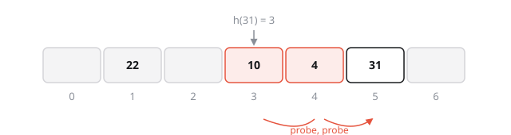

import Pseudocode from '../../components/Pseudocode.astro';
import Mermaid from '../../components/Mermaid.astro';
import HashingAnimation from '../../components/HashingAnimation.astro';

<div class="callout">
  <strong>This is a test post.</strong> It shows everything this blog can render:
  LaTeX from beyond the basics, algorithms, diagrams, images and an animated figure. It
  isn't an article. It's kept as a reference for writing real posts, and it's left off
  the home page.
</div>

## 1. Inline and display maths

Inline maths sits in a sentence: let $U \subset \N$ be a universe of keys and
$\mathcal{H} = \{h : U \to \Z_m\}$ a family of hash functions.

Display maths, written on one line the way Obsidian allows:

$$\underset{h \sim \mathcal{H}}{\Pr} \left[h(x) = h(y)\right] \leq \frac{1}{m}$$

## 2. amsmath environments

`align` with manual tags:

$$
\begin{align}
  \E[X] &= \sum_{i=1}^{n} \Pr[X_i = 1] \tag{1.1} \\
        &= \frac{n}{m} \eqqcolon \alpha \tag{1.2}
\end{align}
$$

`cases`, and `dcases` from mathtools:

$$
T(n) = \begin{dcases}
  \Theta(1) & \text{if } n \leq 1, \\
  2\,T\!\left(\frac{n}{2}\right) + \Theta(n) & \text{otherwise.}
\end{dcases}
$$

Matrices, `split`, braces and extensible arrows:

$$
\begin{pmatrix} a & b \\ c & d \end{pmatrix}
\begin{bmatrix} x \\ y \end{bmatrix}
=
\underbrace{\begin{bmatrix} ax + by \\ cx + dy \end{bmatrix}}_{\text{linear map}}
\qquad
\det \begin{vmatrix} a & b \\ c & d \end{vmatrix} = ad - bc
$$

$$
\begin{split}
  (a + b)^2 &= (a + b)(a + b) \\
            &= a^2 + 2ab + b^2
\end{split}
\qquad
A \xrightarrow[\text{reduce}]{\;f\;} B \xrightarrow{\;g\;} C
$$

$$\boxed{\sum_{\substack{0 \le i < m \\ 0 \le j < n}} a_{ij}}$$

## 3. Notation from other packages

| Package | Rendered |
| --- | --- |
| amssymb / mathrsfs fonts | $\mathbb{R}, \mathfrak{g}, \mathscr{L}, \mathcal{O}, \mathsf{P} \neq \mathsf{NP}$ |
| mathtools | $x \coloneqq 1, \quad f \colon A \to B$ |
| xcolor | $\textcolor{teal}{x} + \colorbox{#fde68a}{highlighted}$ |
| cancel | $\frac{\cancel{3}x}{\cancel{3}} = x, \quad \bcancel{a} \; \xcancel{b}$ |
| braket (quantum) | $\ket{\Phi^+} = \tfrac{1}{\sqrt 2}\left(\ket{00} + \ket{11}\right), \quad \braket{\psi \vert \phi}$ |
| stmaryrd | $\llbracket e_1 + e_2 \rrbracket\rho = \llbracket e_1 \rrbracket\rho + \llbracket e_2 \rrbracket\rho$ |

KaTeX has no preamble, so `\DeclareMathOperator` and friends are replaced by
site-wide macros in `astro.config.mjs`. These all come from there:
$\R$, $\Z$, $\E[X]$, $\Var(X)$, $\bigO(n \log n)$, $\argmax_x f(x)$ and $\sem{e}$.

## 4. Computer-science maths

**Asymptotics.** The master theorem for $T(n) = a\,T(n/b) + f(n)$:

$$
T(n) = \begin{cases}
  \Theta\!\left(n^{\log_b a}\right) & f(n) = \bigO\!\left(n^{\log_b a - \varepsilon}\right) \\[4pt]
  \Theta\!\left(n^{\log_b a} \log n\right) & f(n) = \Theta\!\left(n^{\log_b a}\right) \\[4pt]
  \Theta\!\left(f(n)\right) & f(n) = \Omega\!\left(n^{\log_b a + \varepsilon}\right)
\end{cases}
$$

**Probability.** A Chernoff bound, for $X = \sum_i X_i$ with independent $X_i \in \{0,1\}$ and $\mu = \E[X]$:

$$\Pr\left[X \geq (1+\delta)\mu\right] \leq \left(\frac{e^{\delta}}{(1+\delta)^{1+\delta}}\right)^{\mu}$$

**Number theory.** The Carter–Wegman universal family, for a prime $p \geq |U|$:

$$
h_{a,b}(x) = \big((ax + b) \bmod p\big) \bmod m,
\qquad a \in \Z_p^{*},\; b \in \Z_p
$$

Indexing $m$ buckets takes $\lceil \log_2 m \rceil$ bits, and a complete binary tree on $n$ nodes has height $\lfloor \log_2 n \rfloor$.

**Type rules.** There's no bussproofs, but `\dfrac` gets inference rules for the simply typed lambda calculus:

$$
\begin{gathered}
\frac{x : \tau \in \Gamma}{\Gamma \vdash x : \tau}\;(\text{Var})
\qquad
\frac{\Gamma, x : \tau_1 \vdash e : \tau_2}{\Gamma \vdash \lambda x{:}\tau_1.\, e : \tau_1 \to \tau_2}\;(\text{Abs})
\\[12pt]
\frac{\Gamma \vdash e_1 : \tau_1 \to \tau_2 \qquad \Gamma \vdash e_2 : \tau_1}{\Gamma \vdash e_1\, e_2 : \tau_2}\;(\text{App})
\end{gathered}
$$

**Logic.** $\forall x\, \exists y.\; \neg P(x) \lor Q(x, y)$, $\;\Gamma \models \varphi \iff \Gamma \vdash \varphi$, and $a \equiv b \pmod{m}$.

## 5. Commutative diagrams (amscd)

$$
\begin{CD}
  A @>f>> B \\
  @VgVV @VVhV \\
  C @>>k> D
\end{CD}
\qquad \text{commutes iff } h \circ f = k \circ g
$$

## 6. Algorithms in `algorithmic` syntax

KaTeX has no `algorithmic` environment. These use the same commands
(`\PROCEDURE`, `\IF`, `\FOR`, `\STATE`), rendered at build time by
pseudocode.js with KaTeX handling the maths inside.

<Pseudocode number={1} code={String.raw`
\begin{algorithm}
\caption{Quicksort}
\begin{algorithmic}
\PROCEDURE{Quicksort}{$A, p, r$}
    \IF{$p < r$}
        \STATE $q = $ \CALL{Partition}{$A, p, r$}
        \STATE \CALL{Quicksort}{$A, p, q - 1$}
        \STATE \CALL{Quicksort}{$A, q + 1, r$}
    \ENDIF
\ENDPROCEDURE
\PROCEDURE{Partition}{$A, p, r$}
    \STATE $x = A[r]$
    \STATE $i = p - 1$
    \FOR{$j = p$ \TO $r - 1$}
        \IF{$A[j] \leq x$}
            \STATE $i = i + 1$
            \STATE exchange $A[i]$ with $A[j]$
        \ENDIF
    \ENDFOR
    \STATE exchange $A[i + 1]$ with $A[r]$
    \RETURN $i + 1$
\ENDPROCEDURE
\end{algorithmic}
\end{algorithm}
`} />

<Pseudocode number={2} code={String.raw`
\begin{algorithm}
\caption{Insert into a hash table with chaining}
\begin{algorithmic}
\REQUIRE $h$ drawn uniformly from a universal family $\mathcal{H}$
\FUNCTION{Insert}{$T, k$}
    \STATE $b \gets h(k)$
    \IF{$k \notin T[b]$}
        \STATE prepend $k$ to the list $T[b]$ \COMMENT{$\mathcal{O}(1)$}
    \ENDIF
\ENDFUNCTION
\end{algorithmic}
\end{algorithm}
`} />

## 7. Code

Inline `code`, and a highlighted block that follows the light or dark theme:

```python
def universal_hash(a: int, b: int, p: int, m: int):
    """Return h(x) = ((a*x + b) mod p) mod m."""
    def h(x: int) -> int:
        return ((a * x + b) % p) % m
    return h
```

## 8. Diagrams from text (Mermaid)

Mermaid draws diagrams from a text description, in the browser. It's quick for
flowcharts and sequence diagrams, though less precise than a hand-made SVG.

<Mermaid caption="A flowchart" code={`
flowchart LR
    K[Key k] --> H{"h(k) = k mod m"}
    H --> B[Bucket b]
    B -->|empty| S[Store k]
    B -->|occupied| C[Chain k onto the list]
`} />

<Mermaid caption="A sequence diagram" code={`
sequenceDiagram
    participant C as Client
    participant T as Hash table
    C->>T: insert(31)
    T->>T: h(31) = 3
    T-->>C: collision, chained
    C->>T: lookup(31)
    T-->>C: found in bucket 3
`} />

## 9. An animated diagram

This is the same technique as the animated diagrams on
[kingori.co](https://kingori.co/building-a-timeline-for-task-runners/): an SVG and
a short script that steps through it, with no image or video file involved. It
plays when it scrolls into view. If your system asks for reduced motion, it
jumps straight to the final state.

<HashingAnimation />

## 10. Images

A static image, stored in `src/assets/posts/test-post/` and referenced by a relative
path, so Astro processes it at build time. The alt text doubles as the description
for screen readers.



## 11. What doesn't work

These were each tested against KaTeX 0.18 while building this post:

| LaTeX | Status | Instead |
| --- | --- | --- |
| TikZ / PGF | Not supported | A hand-made SVG like section 9, or an SVG exported from TikZ locally |
| `algorithmic`, `algorithm2e` inside `$$` | Not supported | The pseudocode block in section 6 |
| bussproofs `prooftree` | Not supported | Stacked `\frac`, as in section 4 |
| `\label` / `\eqref` | Not supported | Manual `\tag{…}` and writing "equation (1.1)" |
| `\DeclareMathOperator`, preamble `\newcommand` | Not supported | Site-wide macros in `astro.config.mjs` |
| `multline`, siunitx `\SI`, `\cancelto` | Not supported | `split` / `aligned`, plain `\text{…}` units |

A footnote, to check those render too.[^1]

[^1]: Footnotes come from GitHub-flavoured Markdown.
